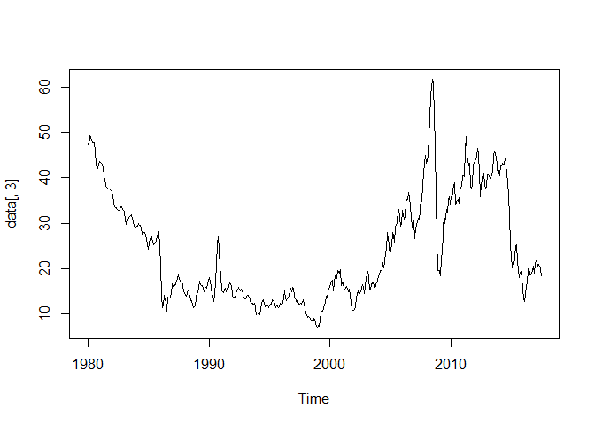
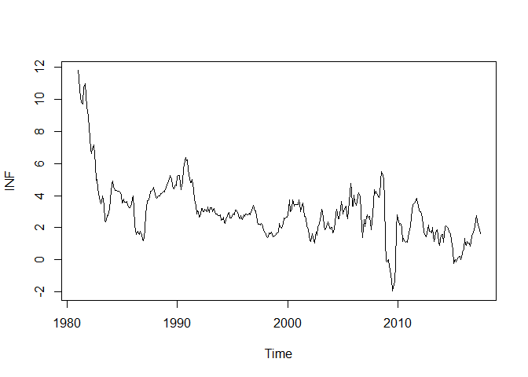
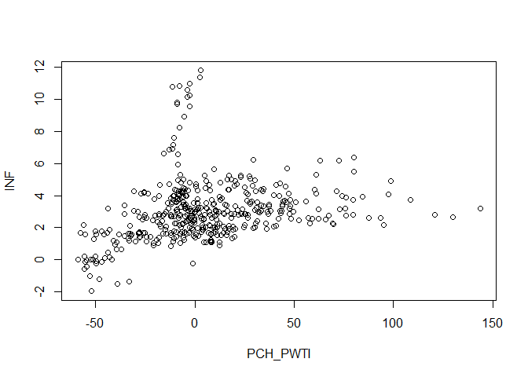
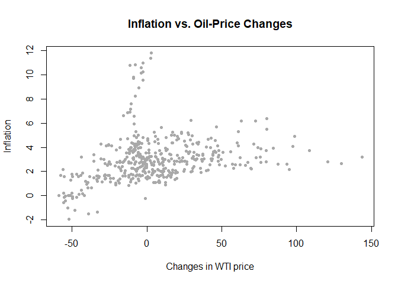
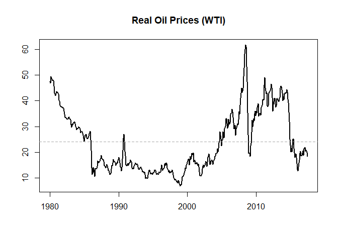

Introduction to Time Series in R
================
Scott W. Hegerty
ECON 343, Spring 2023

This is a basic example to show how to do some introductory tasks in R.
More advanced concepts are explained in other examples.

## Opening a data file

We begin by opeining a provided .csv file. Note the syntax. I always
call my R data object “data.” Remember to check the top and the bottom
of the data for any blank cells or other problems. The dimension will
tell you if your rows and columns match what they should be.

``` r
data<-read.csv("https://raw.githubusercontent.com/hegerty/ECON343/main/ECON343_Lab1_Data.csv",header = TRUE)
head(data)
```

    ##   observation_date  CPI P.WTI.
    ## 1         1/1/1980 78.0  37.00
    ## 2         2/1/1980 79.0  37.04
    ## 3         3/1/1980 80.1  39.52
    ## 4         4/1/1980 80.9  39.50
    ## 5         5/1/1980 81.7  39.50
    ## 6         6/1/1980 82.5  39.50

``` r
tail(data)
```

    ##     observation_date     CPI   P.WTI.
    ## 445         1/1/2017 244.028 52.55955
    ## 446         2/1/2017 244.102 53.40150
    ## 447         3/1/2017 243.717 49.58478
    ## 448         4/1/2017 244.087 51.16800
    ## 449         5/1/2017 243.911 48.55957
    ## 450         6/1/2017 244.032 45.16773

``` r
dim(data)
```

    ## [1] 450   3

## Basic Data Operations

Here, we look at the WTI oil price data from class. It has 3 variables
(the first is the dates), and 450 quarters.

Now we omit all “NAs” (if necessary), and keep only columns 2 and 3.
Note the syntax for *\[rows, columns\]* and the “combinaton” (group) of
2 and 3.

``` r
data<-na.omit(data[,c(2,3)])
```

We also assign new column names, and then make a new column (with a new
name) thah makes the real oil price. Remember that I explain these
procedures in more detail in some of the other examples.

``` r
colnames(data)<-c("CPI","PWTI")
data$RPWTI<-100*data[,2]/data[,1]
head(data)
```

    ##    CPI  PWTI    RPWTI
    ## 1 78.0 37.00 47.43590
    ## 2 79.0 37.04 46.88608
    ## 3 80.1 39.52 49.33833
    ## 4 80.9 39.50 48.82571
    ## 5 81.7 39.50 48.34761
    ## 6 82.5 39.50 47.87879

## Making a Time Series

Next, we make a time series. Note the *ts()* formula, with a start date
of January 1980 and monthly frequency. We can plot out real WTI series
(the third column). We got rid of the dates column, but this object
incorporates them.

``` r
data<-ts(data,start=c(1980,1),frequency = 12)
dim(data)
```

    ## [1] 450   3

``` r
head(data)
```

    ##       CPI  PWTI    RPWTI
    ## [1,] 78.0 37.00 47.43590
    ## [2,] 79.0 37.04 46.88608
    ## [3,] 80.1 39.52 49.33833
    ## [4,] 80.9 39.50 48.82571
    ## [5,] 81.7 39.50 48.34761
    ## [6,] 82.5 39.50 47.87879

``` r
plot(data[,3])
```

<!-- -->

This is kind of ugly, but we will clean it up at the end.

Now, we can make some new variables. Year-on-year inflation (based on a
12-month lag) for column 1 (CPI). Then we make the “price changes” (I
call them “PCH”) for nominal and real WTI. We can plot inflation as
well. Then we add our new variables as extra columns, using *cbind()*.
We check our new data–one issue to watch for is that since we lose
observations when we make change variables, we need to make sure the
missing observations are at the *beginning*.

Here, we plot inflation as a time series. We see the high inflation of
the 1980s, as well as the deflation around the 2008 Great Recession.

``` r
INF<-100*(data[,1]/lag(data[,1],-12)-1)
plot(INF)
```

<!-- -->

``` r
PCH_PWTI<-100*(data[,2]/lag(data[,2],-12)-1)
PCH_RPWTI<-100*(data[,3]/lag(data[,3],-12)-1)
data<-cbind(data,PCH_PWTI,PCH_RPWTI,INF)
head(data)
```

    ##      data.CPI data.PWTI data.RPWTI PCH_PWTI PCH_RPWTI INF
    ## [1,]     78.0     37.00   47.43590       NA        NA  NA
    ## [2,]     79.0     37.04   46.88608       NA        NA  NA
    ## [3,]     80.1     39.52   49.33833       NA        NA  NA
    ## [4,]     80.9     39.50   48.82571       NA        NA  NA
    ## [5,]     81.7     39.50   48.34761       NA        NA  NA
    ## [6,]     82.5     39.50   47.87879       NA        NA  NA

``` r
tail(data)
```

    ##        data.CPI data.PWTI data.RPWTI PCH_PWTI PCH_RPWTI      INF
    ## [445,]  244.028  52.55955   21.53833 65.77808 61.676222 2.537081
    ## [446,]  244.102  53.40150   21.87672 75.96051 71.224533 2.765943
    ## [447,]  243.717  49.58478   20.34523 31.26727 28.199908 2.392636
    ## [448,]  244.087  51.16800   20.96302 24.91316 22.229510 2.195585
    ## [449,]  243.911  48.55957   19.90872  3.65807  1.757545 1.867699
    ## [450,]  244.032  45.16773   18.50894 -7.34566 -8.848438 1.648658

``` r
dim(data)
```

    ## [1] 450   6

We see “NAs” at the top–this is correct, since if we take 12-month
inflation between 1980 and 1981, our first observation will be January
1981. All of 1980 will be blank. We still have 450 quarters, although we
can drop 1-12 with *na.omit()* if we want.

## Statistical Procedures

We can look for correlations between the full dataset, as well as only
the inflation series (columns 4-6):

``` r
cor(data)
```

    ##             data.CPI data.PWTI data.RPWTI PCH_PWTI PCH_RPWTI INF
    ## data.CPI   1.0000000 0.6936660  0.2273968       NA        NA  NA
    ## data.PWTI  0.6936660 1.0000000  0.8336551       NA        NA  NA
    ## data.RPWTI 0.2273968 0.8336551  1.0000000       NA        NA  NA
    ## PCH_PWTI          NA        NA         NA        1        NA  NA
    ## PCH_RPWTI         NA        NA         NA       NA         1  NA
    ## INF               NA        NA         NA       NA        NA   1

``` r
cor(na.omit(data[,4:6]))
```

    ##            PCH_PWTI PCH_RPWTI       INF
    ## PCH_PWTI  1.0000000 0.9986697 0.2690408
    ## PCH_RPWTI 0.9986697 1.0000000 0.2208994
    ## INF       0.2690408 0.2208994 1.0000000

The NAs make this unable to be calculated; here, the *na.omit()*
eliminates these non-numeric values. As an exercise, you could redo the
full-sample table using this command.

The 3-variable table shows a very strong correlation between changes in
nominal and real WTI price changes.

Now, we re-name our variables, and the make a rounded correlation table.
I always suggest 3 decimal places.

``` r
colnames(data)<-c("CPI","PWTI","RPWTI","PCH_PWTI","PCH_RPWTI","INF")
print(round(cor(na.omit(data[,4:6])),3))
```

    ##           PCH_PWTI PCH_RPWTI   INF
    ## PCH_PWTI     1.000     0.999 0.269
    ## PCH_RPWTI    0.999     1.000 0.221
    ## INF          0.269     0.221 1.000

We can calculate the mean for one column (here, it is Column 4).

``` r
mean(na.omit(data[,4]))
```

    ## [1] 5.588066

We can also do all columns using *apply()*. Note the syntax. We chose
columns 3-6, columns (2; rows would be “1”), and the “mean” function. We
do the same for standard deviations, and print both results.

``` r
means<-apply(na.omit(data[,3:6]),2,FUN = "mean")
sds<-apply(na.omit(data[,3:6]),2,FUN = "sd")
print(round(means,3))
```

    ##     RPWTI  PCH_PWTI PCH_RPWTI       INF 
    ##    23.516     5.588     2.363     3.022

``` r
print(round(sds,3))
```

    ##     RPWTI  PCH_PWTI PCH_RPWTI       INF 
    ##    11.410    32.617    31.303     1.902

We see the same mean value from column 4. It is in the second spot
because we only calculated the means for columns 3,4,5, and 6.

We then make a new data frame, omitting the NAs. Them we make a
scatterplot for inflation and (nominal) oil-price inflation.

``` r
data2<-as.data.frame(na.omit(data[,4:6]))
plot(data2[,c(1,3)])
```

<!-- -->

But these plots need some cleaning up. We can change the point type and
color,, re-label the axes, and add a title.

``` r
data2<-as.data.frame(na.omit(data[,4:6]))
plot(data2[,c(1,3)],pch=20,col="dark grey", xlab="Changes in WTI price",
     ylab="Inflation",main = "Inflation vs. Oil-Price Changes")
```

<!-- -->

We can also re-plotting the real oil price, with new labels (which are
blank), custom line width, and a title. We also add a horizontal line
(with custom color, line type, and line width) showing the average over
time.

``` r
plot(data[,3],xlab="",ylab="",lwd=2,main="Real Oil Prices (WTI)")
abline(h=mean(data[,3]),col="dark grey",lty=2,lwd=1.5)
```

<!-- -->

This graph looks much better, while still showing periods of high and
low prices (including the pre-GFC “spike.”)
