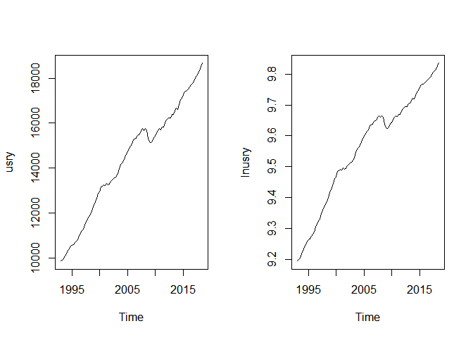
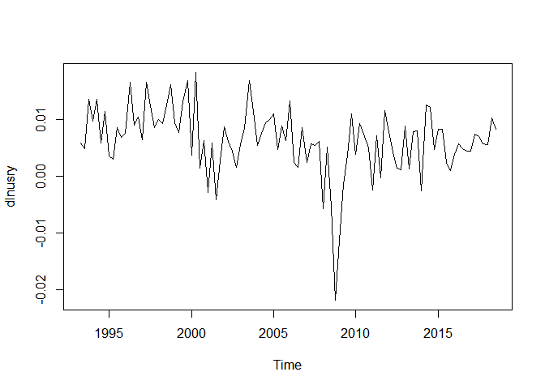
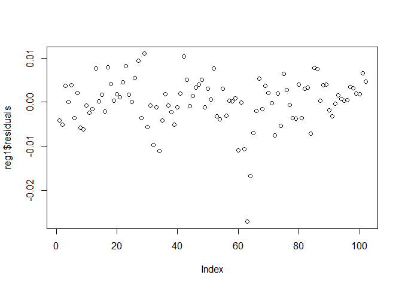
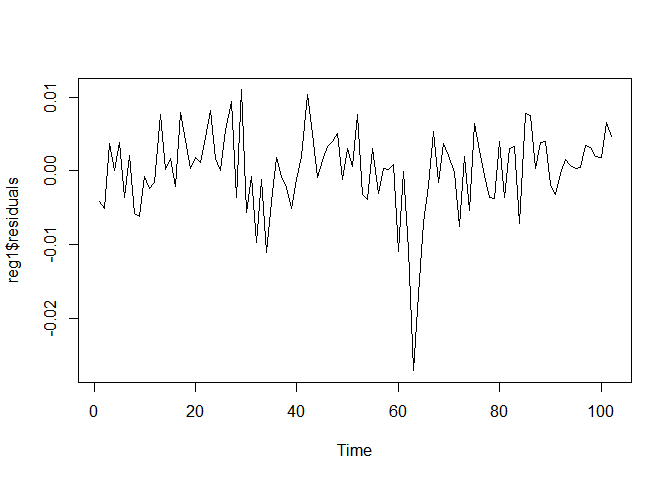

Lags, Differences, and Autocorrelation in R
================
Scott W. Hegerty

***Macroeconomic Data Analysis (ECON 343, NEIU)***

This example takes a time-series variable (quarterly U.S. real GDP) and
creates lag and differenced variables using R. Autoregressive methods
are used, as well as stationarity tests on both the level and
differenced series. Finally, some simple tricks help make a decent table
before exporting the final data to a .csv file. There is also an .R file
on the main GitHub page.

### Introductory procedures

First, open the data (found on the GitHub page), and look at the first
and last observations. Make sure there aren’t any missing values, and
double-check the start and end dates. The dimension is helpful too,
especially to make sure any observations don’t magically appear or
disappear. These data run from 1993Q1 to 2018Q3.

``` r
data<-read.csv("https://raw.githubusercontent.com/hegerty/ECON343/main/USMXRY.csv",header=TRUE)
head(data)
```

    ##        DATE       USY         MXY
    ## 1  1/1/1993  9850.973 2.51651e+12
    ## 2  4/1/1993  9908.347 2.52314e+12
    ## 3  7/1/1993  9955.641 2.55021e+12
    ## 4 10/1/1993 10091.049 2.58241e+12
    ## 5  1/1/1994 10188.954 2.60919e+12
    ## 6  4/1/1994 10327.019 2.66385e+12

``` r
tail(data)
```

    ##          DATE      USY         MXY
    ## 98   4/1/2017 17995.15 4.54370e+12
    ## 99   7/1/2017 18120.84 4.53428e+12
    ## 100 10/1/2017 18223.76 4.57045e+12
    ## 101  1/1/2018 18323.96 4.61912e+12
    ## 102  4/1/2018 18511.58 4.61428e+12
    ## 103  7/1/2018 18664.97 4.65258e+12

``` r
dim(data)
```

    ## [1] 103   3

Next, make a time-series object. We are only using the second column,
which is U.S. real GDP. The new variable name is concise and
understandable to the reader. Note the quarterly frequency (4) and the
start date: c(year, quarter). The log() function takes the natural
logarithm of this variable.

``` r
usry<-ts(data[,2],start=c(1993,1),frequency = 4)
lnusry<-log(usry)
```

Here, we plot the series side-by-side with one row and two columns using
mfrow(). I always return it to (1,1) at the end so that it doesn’t mess
up my next graphs. The variables look similar (they should be!) except
for the scale.

``` r
par(mfrow=c(1,2))
plot(usry)
plot(lnusry)
```

<!-- -->

``` r
par(mfrow=c(1,1))
```

### Lags and Differencing

Now, we make lagged and differenced variables. It is very important to
note that lags can be any value (this example uses one period, which is
very common; another might be a 4-quarter lag to calculate it against
the same period the previous year), but require a negative sign. A
positive value would be a “lead,” which is the wrong direction. You can
line up your data to make sure–the original value for 2015Q3 should be
next to its own value for 2015Q2, for example. You also lose an
observation at the beginning (not at the end) for the lagged variable.
Differencing is basically X - lag(X). Remember that the log difference
is equivalent to percentage changes. Note the output drop during the
2008 recession.

``` r
laglnusry<-lag(lnusry,-1)
dlnusry<-diff(lnusry)
plot(dlnusry)
```

<!-- -->

You can also make a lagged difference–this will be used for the
autocorrelations.

``` r
lagdlnusry<-lag(dlnusry,-1)
```

Here, we put all four of these variables in a new dataframe and check
the first and last observations. Note that it “lines up” properly; the
NAs are in the right places.

``` r
data2<-cbind(lnusry,laglnusry,dlnusry,lagdlnusry)
head(data2)
```

    ##        lnusry laglnusry     dlnusry  lagdlnusry
    ## [1,] 9.195326        NA          NA          NA
    ## [2,] 9.201133  9.195326 0.005807301          NA
    ## [3,] 9.205895  9.201133 0.004761792 0.005807301
    ## [4,] 9.219404  9.205895 0.013509468 0.004761792
    ## [5,] 9.229059  9.219404 0.009655399 0.013509468
    ## [6,] 9.242519  9.229059 0.013459472 0.009655399

``` r
tail(data2)
```

    ##          lnusry laglnusry     dlnusry  lagdlnusry
    ##  [99,] 9.804818  9.797858 0.006960546 0.007369455
    ## [100,] 9.810481  9.804818 0.005663305 0.006960546
    ## [101,] 9.815965  9.810481 0.005483529 0.005663305
    ## [102,] 9.826152  9.815965 0.010186609 0.005483529
    ## [103,] 9.834404  9.826152 0.008252400 0.010186609
    ## [104,]       NA  9.834404          NA 0.008252400

There is now an extra observation (\#104 at the end), since the last
observation has nothing to lag to. This can be removed. Instead of
“hard-coding” the number you could always put in nrow(data2) instead.

``` r
data2<-data2[-104,]
tail(data2)
```

    ##          lnusry laglnusry     dlnusry  lagdlnusry
    ##  [98,] 9.797858  9.790488 0.007369455 0.004423243
    ##  [99,] 9.804818  9.797858 0.006960546 0.007369455
    ## [100,] 9.810481  9.804818 0.005663305 0.006960546
    ## [101,] 9.815965  9.810481 0.005483529 0.005663305
    ## [102,] 9.826152  9.815965 0.010186609 0.005483529
    ## [103,] 9.834404  9.826152 0.008252400 0.010186609

### Performing the Autoregressions

Here we start by doing simple OLS and regressing *lnusry* on its lag.
The coefficient is close to one, indicating a high degree of
persistence. But this is likely because the series is onstationary. It
needs to be first-differenced.

``` r
reg1<-lm(data2[,1]~data2[,2])
summary(reg1)
```

    ## 
    ## Call:
    ## lm(formula = data2[, 1] ~ data2[, 2])
    ## 
    ## Residuals:
    ##        Min         1Q     Median         3Q        Max 
    ## -0.0271221 -0.0028581  0.0003515  0.0033970  0.0109662 
    ## 
    ## Coefficients:
    ##             Estimate Std. Error t value Pr(>|t|)    
    ## (Intercept)  0.10228    0.03040   3.364  0.00109 ** 
    ## data2[, 2]   0.98996    0.00318 311.261  < 2e-16 ***
    ## ---
    ## Signif. codes:  0 '***' 0.001 '**' 0.01 '*' 0.05 '.' 0.1 ' ' 1
    ## 
    ## Residual standard error: 0.005607 on 100 degrees of freedom
    ##   (1 observation deleted due to missingness)
    ## Multiple R-squared:  0.999,  Adjusted R-squared:  0.999 
    ## F-statistic: 9.688e+04 on 1 and 100 DF,  p-value: < 2.2e-16

Note that simply plotting the regression residuals does not include time
as the x-axis.

``` r
plot(reg1$residuals)
```

<!-- -->

But we can plot a time series of the residuals using plot.ts()

``` r
plot.ts(reg1$residuals)
```

<!-- -->

As was noted previously, U.S. real GDP is nonstationary. The mean is
time-variant; it is usually greater later in the series. We can conduct
the Phillips-Perron stationarity test to make sure. The null hypothesis
of nonstationarity is rejected (check the p-value!) for the
regression-residuals, though:

``` r
PP.test(reg1$residuals)
```

    ## 
    ##  Phillips-Perron Unit Root Test
    ## 
    ## data:  reg1$residuals
    ## Dickey-Fuller = -7.3011, Truncation lag parameter = 4, p-value = 0.01

But the original (non-logged) series is not. Log GDP is also
nonstationary. Note the two ways to define the columns to test.

``` r
PP.test(data$USY)
```

    ## 
    ##  Phillips-Perron Unit Root Test
    ## 
    ## data:  data$USY
    ## Dickey-Fuller = -1.7299, Truncation lag parameter = 4, p-value = 0.6886

``` r
PP.test(data2[,1])
```

    ## 
    ##  Phillips-Perron Unit Root Test
    ## 
    ## data:  data2[, 1]
    ## Dickey-Fuller = -1.8252, Truncation lag parameter = 4, p-value = 0.6491

Next, we try an OLS autoregression on the differenced *lnusry* series.
The intercept (which is included here) and the “rho” autocorrelation
coefficient are both significant.

``` r
reg2<-lm(data2[,3]~data2[,4])
summary(reg2)
```

    ## 
    ## Call:
    ## lm(formula = data2[, 3] ~ data2[, 4])
    ## 
    ## Residuals:
    ##        Min         1Q     Median         3Q        Max 
    ## -0.0237080 -0.0029122  0.0002634  0.0033243  0.0128775 
    ## 
    ## Coefficients:
    ##              Estimate Std. Error t value Pr(>|t|)    
    ## (Intercept) 0.0038958  0.0007958   4.895 3.82e-06 ***
    ## data2[, 4]  0.3801291  0.0930187   4.087 8.91e-05 ***
    ## ---
    ## Signif. codes:  0 '***' 0.001 '**' 0.01 '*' 0.05 '.' 0.1 ' ' 1
    ## 
    ## Residual standard error: 0.005466 on 99 degrees of freedom
    ##   (2 observations deleted due to missingness)
    ## Multiple R-squared:  0.1443, Adjusted R-squared:  0.1357 
    ## F-statistic:  16.7 on 1 and 99 DF,  p-value: 8.905e-05

We can also use the base R command ar(). This is of order one (one lag
only).

``` r
ar1<-ar(dlnusry,order.max = 1)
ar1
```

    ## 
    ## Call:
    ## ar(x = dlnusry, order.max = 1)
    ## 
    ## Coefficients:
    ##      1  
    ## 0.3797  
    ## 
    ## Order selected 1  sigma^2 estimated as  2.959e-05

We can also use the arima() function. These are depicted as
(*p*,*d*,*q*). We already know there is one autoregressive lag, so *p* =
1 in this case. We have already first differenced, so *d* = 0 (but we
could use levels and have *d* = 1 on *lnusry*). *q* is for the moving
average lags, but since we are not using any it equals zero.

``` r
arima1<-arima(dlnusry,order = c(1,0,0))
arima1
```

    ## 
    ## Call:
    ## arima(x = dlnusry, order = c(1, 0, 0))
    ## 
    ## Coefficients:
    ##          ar1  intercept
    ##       0.3764     0.0063
    ## s.e.  0.0910     0.0009
    ## 
    ## sigma^2 estimated as 2.9e-05:  log likelihood = 388.05,  aic = -770.1

The values are not exactly the same, but the significance levels are.

### Making a decent table

We can make a results table in R without immediately exporting a file
and opening in Excel. There are more advanced ways to do this, but here
is a start.

First, we can extract the important values from a regression object
using the *$* operator and/or finding components using brackets ( \[ \]
). We can isolate the full coefficients results, for example, as
follows. These happens to be \#4, and you can look for the other
components that correspond to different numbers. We can subset further
to get just the t-statistic, but it works better if you make a new
object to do so.

``` r
summary(reg2)[4]
```

    ## $coefficients
    ##              Estimate   Std. Error  t value     Pr(>|t|)
    ## (Intercept) 0.0038958 0.0007958366 4.895226 3.818951e-06
    ## data2[, 4]  0.3801291 0.0930186818 4.086589 8.905437e-05

Here, we start with a simple table. We keep only columns 1 (the
coefficients) and 3 (the t-statistic).

``` r
table1<-summary(reg2)[4]
table1$coefficients[,c(1,3)]
```

    ##              Estimate  t value
    ## (Intercept) 0.0038958 4.895226
    ## data2[, 4]  0.3801291 4.086589

``` r
table<-table1$coefficients[,c(1,3)]
```

We need to add row labels and round the values to three digits.

``` r
rownames(table)<-c("Constant","DLNY(-1)")
round(table,3)
```

    ##          Estimate t value
    ## Constant    0.004   4.895
    ## DLNY(-1)    0.380   4.087

Next, we concatenate the values and add parentheses as part of a new
table. We use the paste() command as follows.

``` r
t1<-paste(round(table[1,1],3)," (",round(table[1,2],3),")",sep="")
t2<-paste(round(table[2,1],3)," (",round(table[2,2],3),")",sep="")
```

We can also include R-squared in out table. It is part of the regression
summary.

``` r
table2<-rbind(t1,t2,round(summary(reg2)$r.squared,3))
table2
```

    ##    [,1]           
    ## t1 "0.004 (4.895)"
    ## t2 "0.38 (4.087)" 
    ##    "0.144"

We need to remove the quote marks and add row and column names to the
table.

``` r
table2<-noquote(table2)
table2
```

    ##    [,1]         
    ## t1 0.004 (4.895)
    ## t2 0.38 (4.087) 
    ##    0.144

``` r
rownames(table2)<-c("Constant","DLNY(-1)","R-sq.")
colnames(table2)<-"Coeff. (t-stat.)"
```

This table now looks better than before.

``` r
table2
```

    ##          Coeff. (t-stat.)
    ## Constant 0.004 (4.895)   
    ## DLNY(-1) 0.38 (4.087)    
    ## R-sq.    0.144

You can write it to a .csv file if needed and work further with it in
other software.

``` r
#write.csv(table2,"Table2.csv")
```
