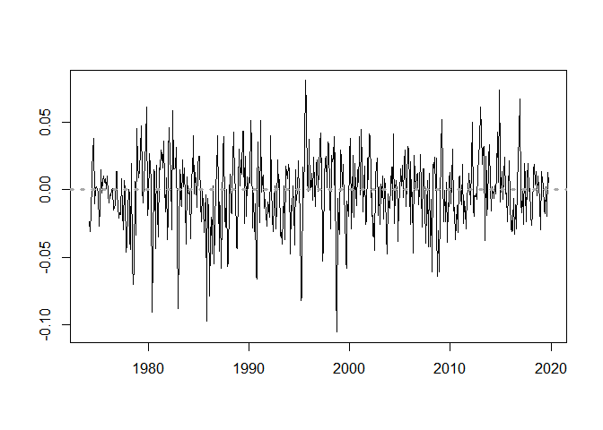
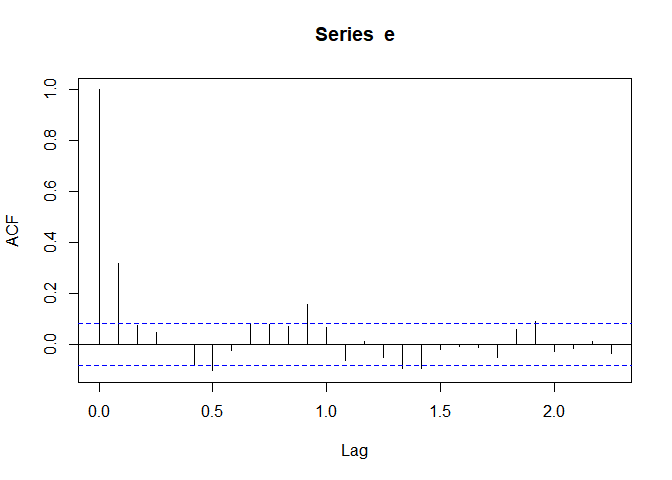
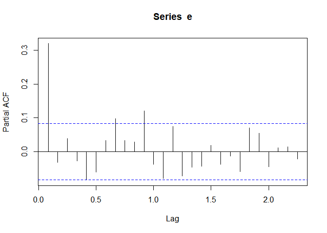
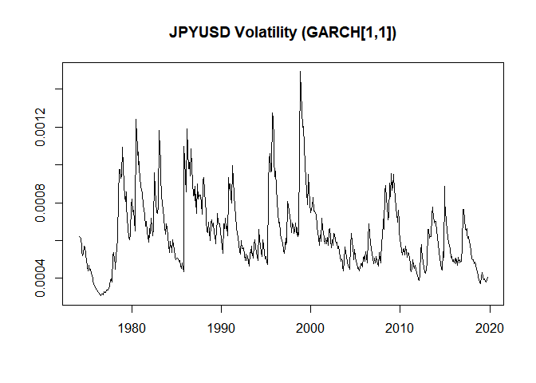
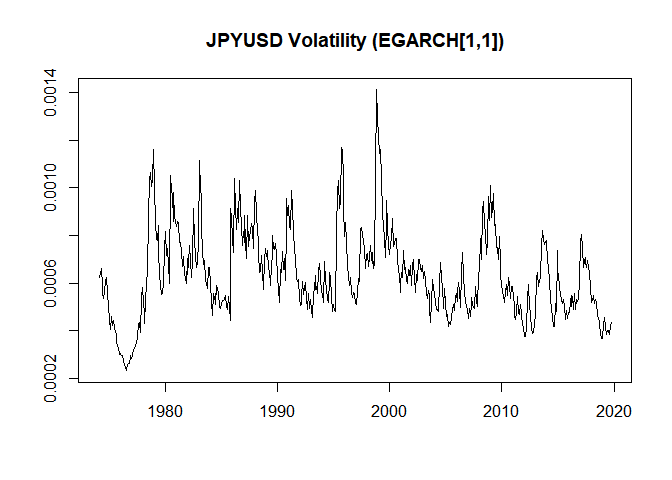
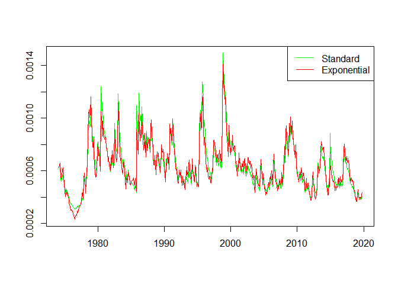
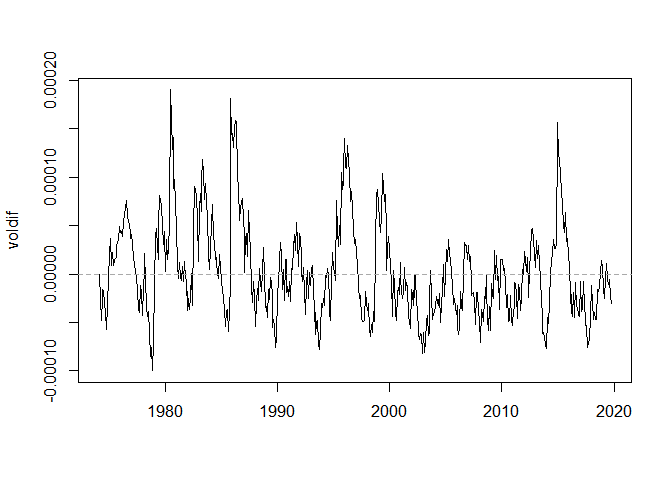
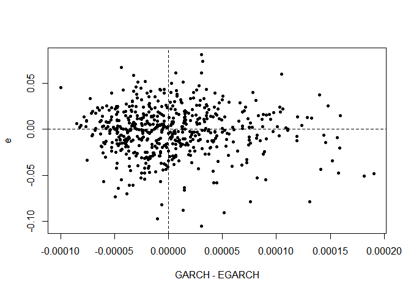
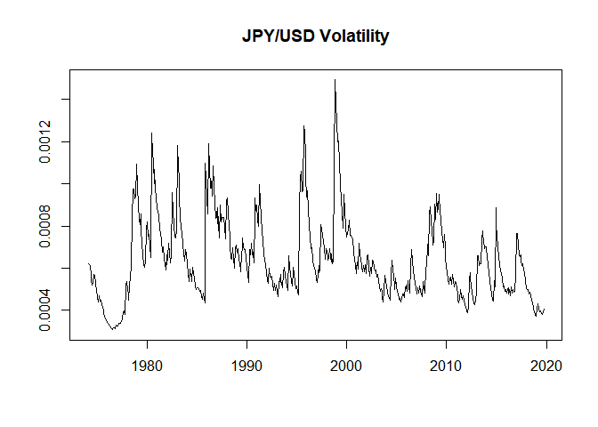

Volatility Modeling: GARCH Processes in R
================
Scott W. Hegerty

***Macroeconomic Data Analysis (ECON 343, NEIU)***

This example generates a volatility series for monthly returns to the
yen/dollar bilateral exchange rates. The mean equation is based on an
ARIMA model, and two different GARCH variations are compared.

### Introductory procedures

First, import the data (from the GitHub site) and check to make sure
they are OK. The last observations will show if any NAs at the end, or
if any blank cells appeared. These look good. The data end in October
2019.

``` r
data<-read.csv("https://raw.githubusercontent.com/hegerty/ECON343/main/JPYUSD.csv")
tail(data)
```

    ##          DATE   EXJPUS
    ## 545  5/1/2019 109.9714
    ## 546  6/1/2019 108.0685
    ## 547  7/1/2019 108.2864
    ## 548  8/1/2019 106.1886
    ## 549  9/1/2019 107.5400
    ## 550 10/1/2019 108.1368

Now, we make a time series out of column 2. The “level” of the exchange
rate is named *E* and the returns, calculated as log differences, are
named *e* . Note the ts() command, with the end date as (year,month) and
monthly frequency.

``` r
E<-ts(data[,2],end=c(2019,10),frequency = 12)
e=diff(log(E))
```

We can plot these returns, adding a zero line to show appreciations and
depreciations. We omit the axis labels and make the zero line dashed,
thick, and dark grey.

``` r
plot(e,ylab="",xlab="")
abline(h=0,col="dark grey",lty=3,lwd=3)
```

<!-- -->

### The Mean Equation

To get the mean equation, we look for an appropriate ARMA(*p*,*q*) model
using the traditional Box-Jenkins approach. The ACF shows one big
“spike” (after 0 lags!) and the PACF has none. To me, this looks like an
AR(1) process. Both coefficients are significant.

``` r
acf(e)
```

<!-- -->

``` r
pacf(e)
```

<!-- -->

``` r
ar1<-arima(e,c(1,0,0))
ar1
```

    ## 
    ## Call:
    ## arima(x = e, order = c(1, 0, 0))
    ## 
    ## Coefficients:
    ##          ar1  intercept
    ##       0.3193    -0.0019
    ## s.e.  0.0404     0.0016
    ## 
    ## sigma^2 estimated as 0.0006225:  log likelihood = 1247.25,  aic = -2488.5

Adding an extra AR or MA term, to get an AR(2,0) and an AR(1,1) produces
insignificant coefficients. This supports using the simpler AR(1) model.

``` r
ar2<-arima(e,c(2,0,0))
ar2
```

    ## 
    ## Call:
    ## arima(x = e, order = c(2, 0, 0))
    ## 
    ## Coefficients:
    ##          ar1      ar2  intercept
    ##       0.3290  -0.0305    -0.0019
    ## s.e.  0.0426   0.0427     0.0015
    ## 
    ## sigma^2 estimated as 0.0006219:  log likelihood = 1247.5,  aic = -2487.01

``` r
arma11<-arima(e,c(1,0,1))
arma11
```

    ## 
    ## Call:
    ## arima(x = e, order = c(1, 0, 1))
    ## 
    ## Coefficients:
    ##          ar1     ma1  intercept
    ##       0.2078  0.1237    -0.0019
    ## s.e.  0.1447  0.1485     0.0015
    ## 
    ## sigma^2 estimated as 0.0006217:  log likelihood = 1247.58,  aic = -2487.16

### Modeling Volatility

You may need to install the ‘rugarch’ package before you call it. We
specify the GARCH model as the **s**tandard GARCH(1,1) and an AR(1)
model, which is the same as an ARMA(1,0) as the mean equation.

``` r
g1<-ugarchspec(variance.model=list(model="sGARCH",garchOrder=c(1,1)),
               mean.model=list(armaOrder=c(1,0)),distribution.model="std")
```

Next, we fit the model and examine the coefficients.

``` r
garch11<-ugarchfit(g1,data = e)
garch11
```

    ## 
    ## *---------------------------------*
    ## *          GARCH Model Fit        *
    ## *---------------------------------*
    ## 
    ## Conditional Variance Dynamics    
    ## -----------------------------------
    ## GARCH Model  : sGARCH(1,1)
    ## Mean Model   : ARFIMA(1,0,0)
    ## Distribution : std 
    ## 
    ## Optimal Parameters
    ## ------------------------------------
    ##         Estimate  Std. Error  t value Pr(>|t|)
    ## mu     -0.001337    0.001437 -0.93042 0.352151
    ## ar1     0.296010    0.042029  7.04301 0.000000
    ## omega   0.000034    0.000026  1.29480 0.195388
    ## alpha1  0.076179    0.032054  2.37661 0.017473
    ## beta1   0.872235    0.056984 15.30654 0.000000
    ## shape  11.336806    4.640020  2.44327 0.014555
    ## 
    ## Robust Standard Errors:
    ##         Estimate  Std. Error  t value Pr(>|t|)
    ## mu     -0.001337    0.001386 -0.96485 0.334618
    ## ar1     0.296010    0.033250  8.90262 0.000000
    ## omega   0.000034    0.000032  1.04963 0.293886
    ## alpha1  0.076179    0.035151  2.16720 0.030219
    ## beta1   0.872235    0.056474 15.44484 0.000000
    ## shape  11.336806    5.109093  2.21895 0.026490
    ## 
    ## LogLikelihood : 1257.207 
    ## 
    ## Information Criteria
    ## ------------------------------------
    ##                     
    ## Akaike       -4.5581
    ## Bayes        -4.5110
    ## Shibata      -4.5584
    ## Hannan-Quinn -4.5397
    ## 
    ## Weighted Ljung-Box Test on Standardized Residuals
    ## ------------------------------------
    ##                         statistic p-value
    ## Lag[1]                     0.5330  0.4654
    ## Lag[2*(p+q)+(p+q)-1][2]    0.5907  0.9388
    ## Lag[4*(p+q)+(p+q)-1][5]    1.2316  0.9064
    ## d.o.f=1
    ## H0 : No serial correlation
    ## 
    ## Weighted Ljung-Box Test on Standardized Squared Residuals
    ## ------------------------------------
    ##                         statistic p-value
    ## Lag[1]                     0.2777  0.5982
    ## Lag[2*(p+q)+(p+q)-1][5]    2.1399  0.5857
    ## Lag[4*(p+q)+(p+q)-1][9]    3.1727  0.7301
    ## d.o.f=2
    ## 
    ## Weighted ARCH LM Tests
    ## ------------------------------------
    ##             Statistic Shape Scale P-Value
    ## ARCH Lag[3]    0.9672 0.500 2.000  0.3254
    ## ARCH Lag[5]    1.8651 1.440 1.667  0.5018
    ## ARCH Lag[7]    2.2032 2.315 1.543  0.6743
    ## 
    ## Nyblom stability test
    ## ------------------------------------
    ## Joint Statistic:  1.3061
    ## Individual Statistics:             
    ## mu     0.1040
    ## ar1    0.1947
    ## omega  0.1736
    ## alpha1 0.1277
    ## beta1  0.1555
    ## shape  0.1961
    ## 
    ## Asymptotic Critical Values (10% 5% 1%)
    ## Joint Statistic:          1.49 1.68 2.12
    ## Individual Statistic:     0.35 0.47 0.75
    ## 
    ## Sign Bias Test
    ## ------------------------------------
    ##                    t-value   prob sig
    ## Sign Bias           1.1276 0.2600    
    ## Negative Sign Bias  0.5068 0.6125    
    ## Positive Sign Bias  0.9367 0.3493    
    ## Joint Effect        1.3839 0.7093    
    ## 
    ## 
    ## Adjusted Pearson Goodness-of-Fit Test:
    ## ------------------------------------
    ##   group statistic p-value(g-1)
    ## 1    20     22.18       0.2752
    ## 2    30     32.69       0.2903
    ## 3    40     46.34       0.1954
    ## 4    50     56.92       0.2041
    ## 
    ## 
    ## Elapsed time : 0.285836

The relevant coefficients are all significant. We note the AIC (here:
-4.5581) to compare the goodness of fit against other potential models.
We take the one with the lowest value.

We can make a GARCH variance series out of this equation.

``` r
vole <- ts(garch11@fit$sigma^2,end=c(2019,10),frequency = 12)
```

Next, we plot this volatility series, with axis labels and a header

``` r
plot(vole,xlab="",ylab="",main="JPYUSD Volatility (GARCH[1,1])")
```

<!-- -->

As an alternative estimation, we try an Exponential GARCH (EGARCH)
model. This allows for different effects due to positive and negative
shocks. Currency markets might behave asymmetrically in this way.

``` r
g1e<-ugarchspec(variance.model=list(model="eGARCH",garchOrder=c(1,1)),
                mean.model=list(armaOrder=c(1,0)),distribution.model="std")
garch11e<-ugarchfit(g1e,data = e)
coef(garch11e)
```

    ##           mu          ar1        omega       alpha1        beta1       gamma1 
    ## -0.001306367  0.298456711 -0.525116089 -0.010342142  0.929250256  0.176286323 
    ##        shape 
    ## 11.429332189

``` r
garch11e
```

    ## 
    ## *---------------------------------*
    ## *          GARCH Model Fit        *
    ## *---------------------------------*
    ## 
    ## Conditional Variance Dynamics    
    ## -----------------------------------
    ## GARCH Model  : eGARCH(1,1)
    ## Mean Model   : ARFIMA(1,0,0)
    ## Distribution : std 
    ## 
    ## Optimal Parameters
    ## ------------------------------------
    ##         Estimate  Std. Error  t value Pr(>|t|)
    ## mu     -0.001306    0.001441 -0.90657 0.364636
    ## ar1     0.298457    0.041969  7.11131 0.000000
    ## omega  -0.525116    0.562768 -0.93310 0.350771
    ## alpha1 -0.010342    0.032549 -0.31774 0.750682
    ## beta1   0.929250    0.075915 12.24070 0.000000
    ## gamma1  0.176286    0.062966  2.79969 0.005115
    ## shape  11.429332    4.645721  2.46019 0.013887
    ## 
    ## Robust Standard Errors:
    ##         Estimate  Std. Error  t value Pr(>|t|)
    ## mu     -0.001306    0.001442 -0.90599 0.364940
    ## ar1     0.298457    0.033364  8.94559 0.000000
    ## omega  -0.525116    1.195202 -0.43935 0.660405
    ## alpha1 -0.010342    0.031962 -0.32358 0.746256
    ## beta1   0.929250    0.161594  5.75054 0.000000
    ## gamma1  0.176286    0.093175  1.89200 0.058491
    ## shape  11.429332    5.006899  2.28272 0.022447
    ## 
    ## LogLikelihood : 1257.601 
    ## 
    ## Information Criteria
    ## ------------------------------------
    ##                     
    ## Akaike       -4.5559
    ## Bayes        -4.5010
    ## Shibata      -4.5562
    ## Hannan-Quinn -4.5345
    ## 
    ## Weighted Ljung-Box Test on Standardized Residuals
    ## ------------------------------------
    ##                         statistic p-value
    ## Lag[1]                     0.6822  0.4088
    ## Lag[2*(p+q)+(p+q)-1][2]    0.8028  0.8500
    ## Lag[4*(p+q)+(p+q)-1][5]    1.5039  0.8457
    ## d.o.f=1
    ## H0 : No serial correlation
    ## 
    ## Weighted Ljung-Box Test on Standardized Squared Residuals
    ## ------------------------------------
    ##                         statistic p-value
    ## Lag[1]                     0.1573  0.6917
    ## Lag[2*(p+q)+(p+q)-1][5]    2.3101  0.5472
    ## Lag[4*(p+q)+(p+q)-1][9]    3.5487  0.6660
    ## d.o.f=2
    ## 
    ## Weighted ARCH LM Tests
    ## ------------------------------------
    ##             Statistic Shape Scale P-Value
    ## ARCH Lag[3]     1.110 0.500 2.000  0.2920
    ## ARCH Lag[5]     2.599 1.440 1.667  0.3535
    ## ARCH Lag[7]     2.966 2.315 1.543  0.5200
    ## 
    ## Nyblom stability test
    ## ------------------------------------
    ## Joint Statistic:  1.4954
    ## Individual Statistics:              
    ## mu     0.10418
    ## ar1    0.19512
    ## omega  0.17961
    ## alpha1 0.09718
    ## beta1  0.17808
    ## gamma1 0.42036
    ## shape  0.18280
    ## 
    ## Asymptotic Critical Values (10% 5% 1%)
    ## Joint Statistic:          1.69 1.9 2.35
    ## Individual Statistic:     0.35 0.47 0.75
    ## 
    ## Sign Bias Test
    ## ------------------------------------
    ##                    t-value   prob sig
    ## Sign Bias           1.1150 0.2654    
    ## Negative Sign Bias  0.4013 0.6883    
    ## Positive Sign Bias  1.0431 0.2974    
    ## Joint Effect        1.4644 0.6905    
    ## 
    ## 
    ## Adjusted Pearson Goodness-of-Fit Test:
    ## ------------------------------------
    ##   group statistic p-value(g-1)
    ## 1    20     23.06       0.2348
    ## 2    30     37.61       0.1312
    ## 3    40     48.38       0.1443
    ## 4    50     48.18       0.5064
    ## 
    ## 
    ## Elapsed time : 0.6256008

The AIC is -4.559, which is slightly greater than using standard GARCH.
Plus, not all coefficients are significant, particularly the “gamma”
(asymmetry) term using robust standard errors. In addition to my
tendency to err on the side of the simpler model, all these point to
using the “Standard” GARCH model.

We sill make an EGARCH volatilaty series, though, and plot it.

``` r
vole2 <- ts(garch11e@fit$sigma^2,end=c(2019,10),frequency = 12)
plot(vole2,xlab="",ylab="",main="JPYUSD Volatility (EGARCH[1,1])")
```

<!-- -->

### Comparing Models

How similar are the series? We can calculate the correlation.

``` r
cor(vole,vole2)
```

    ## [1] 0.9676512

We can also plot them both together. The “peaks” might be slightly
different (larger on the positive side for standard GARCH and on the
negative side for Exponential GARCH), but otherwise they look pretty
similar.

``` r
ts.plot(vole,vole2,col=c("green","red"),xlab="")
legend("topright",legend=c("Standard","Exponential"),col=c("green","red"),lty=c(1,1))
```

<!-- -->

Next we try plotting difference in th two measures

``` r
voldif<-vole-vole2
plot(voldif,xlab="")
abline(h=0,col="dark grey",lty=2)
```

<!-- -->

Finally, we plot the difference in measures vs. exchange rate returns.

``` r
plot(voldif,e,pch=20,xlab="GARCH - EGARCH")
abline(h=0,lty=2)
abline(v=0,lty=2)
```

<!-- -->

``` r
cor(voldif,e)
```

    ## [1] -0.04008228

They are not very correlated. We return to the standard GARCH variance
series. <!-- -->

As might be expected, there were periods of high volatility during the
1997 Asian Crisis and the 2008 Global Financial Crisis. But there were
other periods as well, such as during the 1980s. Overall variability
seems to be lower later on in the sample.
