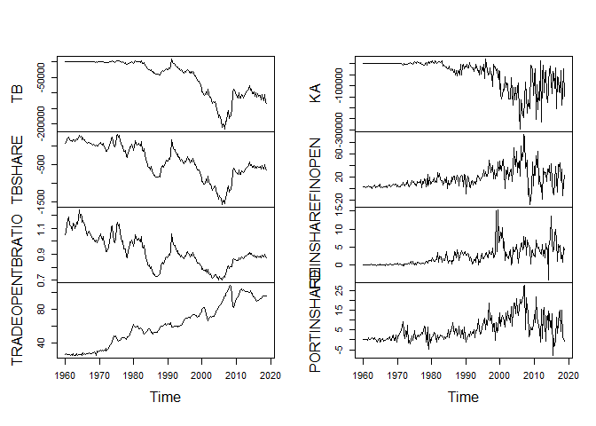
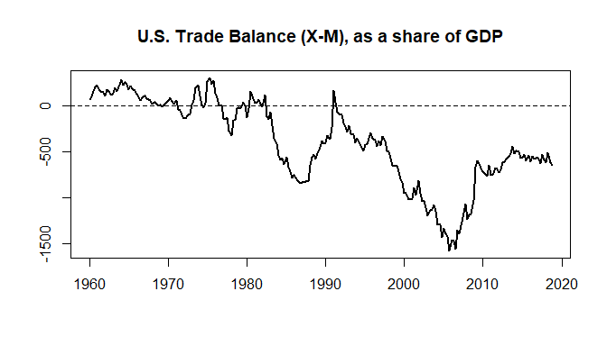

International Variables: Example
================
Scott W. Hegerty
ECON 343, Spring 2023

Here, we use data from the Bureau of Economic Analysis to examine
economic openness and movements in goods and capital. We create new
variables, including the trade balance and net capital flows. Each can
be depicted in several different ways.

### Procedure

First, we open the data from the course website:

``` r
data<-read.csv("https://raw.githubusercontent.com/hegerty/ECON343/main/343_BOP_DATA.csv",header=TRUE)
head(data,2)
```

    ##    ï.. Gross.domestic.product
    ## 1 1960                  542.6
    ## 2   NA                  541.1
    ##   Exports.of.goods.and.services.and.income.receipts..credits.
    ## 1                                                        7355
    ## 2                                                        7762
    ##   Imports.of.goods.and.services.and.income.payments..debits.
    ## 1                                                       7005
    ## 2                                                       7232
    ##   Net.U.S..acquisition.of.financial.assets.excluding.financial.derivatives..net.increase.in.assets...financial.outflow.....
    ## 1                                                                                                                      1066
    ## 2                                                                                                                      1156
    ##   Direct.investment.assets Portfolio.investment.assets
    ## 1                      664                         266
    ## 2                      586                         166
    ##   Net.U.S..incurrence.of.liabilities.excluding.financial.derivatives..net.increase.in.liabilities...financial.inflow.....
    ## 1                                                                                                                     926
    ## 2                                                                                                                     912
    ##   Direct.investment.liabilities Portfolio.investment.liabilities
    ## 1                            89                              197
    ## 2                           102                               27

We will have to rename the variables. Make sure to keep them concise and
and informative.

We can examine the original variable names to guide us as we make new
names:

``` r
colnames(data)
```

    ##  [1] "ï.."                                                                                                                      
    ##  [2] "Gross.domestic.product"                                                                                                   
    ##  [3] "Exports.of.goods.and.services.and.income.receipts..credits."                                                              
    ##  [4] "Imports.of.goods.and.services.and.income.payments..debits."                                                               
    ##  [5] "Net.U.S..acquisition.of.financial.assets.excluding.financial.derivatives..net.increase.in.assets...financial.outflow....."
    ##  [6] "Direct.investment.assets"                                                                                                 
    ##  [7] "Portfolio.investment.assets"                                                                                              
    ##  [8] "Net.U.S..incurrence.of.liabilities.excluding.financial.derivatives..net.increase.in.liabilities...financial.inflow....."  
    ##  [9] "Direct.investment.liabilities"                                                                                            
    ## [10] "Portfolio.investment.liabilities"

``` r
colnames(data)<-c("YEAR","Y","X","M","KOUT","FDIOUT","PORTOUT","KIN","FDIIN","PORTIN")
head(data)
```

    ##   YEAR     Y    X    M KOUT FDIOUT PORTOUT KIN FDIIN PORTIN
    ## 1 1960 542.6 7355 7005 1066    664     266 926    89    197
    ## 2   NA 541.1 7762 7232 1156    586     166 912   102     27
    ## 3   NA 545.6 7650 6814  956    754     111 381    93    138
    ## 4   NA 540.2 7791 6683  923    936     120  77    31    211
    ## 5 1961 545.0 7827 6588 1320    774     135 435    68     88
    ## 6   NA 555.5 7773 6867 1029    551     246 620    86   -195

We can also drop the first column. It has four observations per year,
but three are empty:

``` r
data<-data[,-1]
```

Now, we create new variables: The trade balance and its share of GDP;
net capital flows; ratios of inflows to outflows; and an “openness
measure.” We also measure FDI and portfolio investment liabilities as
shares of GDP. These all have different uses and are measured in
different ways. Balances are in dollars (or other currency), shares are
measured as percentages, and ratios have no units and equal 1 if the
numerator and denominator are balanced. These new variables areadded
directly to the set of existing variables:

``` r
data$TB<-data$X-data$M
data$TBSHARE<-100*data$TB/data$Y
data$TBRATIO<-data$X/data$M
data$TRADEOPEN<-(data$X+data$M)/data$Y
data$KA<-data$KOUT-data$KIN
data$FINOPEN<-(data$KIN+data$KOUT)/data$Y
data$FDIINSHARE<-data$FDIIN/data$Y
data$PORTINSHARE<-data$PORTIN/data$Y
head(data)
```

    ##       Y    X    M KOUT FDIOUT PORTOUT KIN FDIIN PORTIN   TB   TBSHARE  TBRATIO
    ## 1 542.6 7355 7005 1066    664     266 926    89    197  350  64.50424 1.049964
    ## 2 541.1 7762 7232 1156    586     166 912   102     27  530  97.94862 1.073285
    ## 3 545.6 7650 6814  956    754     111 381    93    138  836 153.22581 1.122689
    ## 4 540.2 7791 6683  923    936     120  77    31    211 1108 205.10922 1.165794
    ## 5 545.0 7827 6588 1320    774     135 435    68     88 1239 227.33945 1.188069
    ## 6 555.5 7773 6867 1029    551     246 620    86   -195  906 163.09631 1.131935
    ##   TRADEOPEN  KA  FINOPEN FDIINSHARE PORTINSHARE
    ## 1  26.46517 140 3.671213 0.16402506  0.36306672
    ## 2  27.71022 244 3.821844 0.18850490  0.04989836
    ## 3  26.51026 575 2.450513 0.17045455  0.25293255
    ## 4  26.79378 846 1.851166 0.05738615  0.39059608
    ## 5  26.44954 885 3.220183 0.12477064  0.16146789
    ## 6  26.35464 409 2.968497 0.15481548 -0.35103510

Next we set these variables as a time series:

``` r
datats<-ts(data,start=c(1960,1),frequency = 4)
head(datats)
```

    ##          Y    X    M KOUT FDIOUT PORTOUT KIN FDIIN PORTIN   TB   TBSHARE
    ## [1,] 542.6 7355 7005 1066    664     266 926    89    197  350  64.50424
    ## [2,] 541.1 7762 7232 1156    586     166 912   102     27  530  97.94862
    ## [3,] 545.6 7650 6814  956    754     111 381    93    138  836 153.22581
    ## [4,] 540.2 7791 6683  923    936     120  77    31    211 1108 205.10922
    ## [5,] 545.0 7827 6588 1320    774     135 435    68     88 1239 227.33945
    ## [6,] 555.5 7773 6867 1029    551     246 620    86   -195  906 163.09631
    ##       TBRATIO TRADEOPEN  KA  FINOPEN FDIINSHARE PORTINSHARE
    ## [1,] 1.049964  26.46517 140 3.671213 0.16402506  0.36306672
    ## [2,] 1.073285  27.71022 244 3.821844 0.18850490  0.04989836
    ## [3,] 1.122689  26.51026 575 2.450513 0.17045455  0.25293255
    ## [4,] 1.165794  26.79378 846 1.851166 0.05738615  0.39059608
    ## [5,] 1.188069  26.44954 885 3.220183 0.12477064  0.16146789
    ## [6,] 1.131935  26.35464 409 2.968497 0.15481548 -0.35103510

There are too many variables to plot at once, so we focus on the new
ones.

``` r
dim(datats)
```

    ## [1] 236  17

``` r
colnames(datats)
```

    ##  [1] "Y"           "X"           "M"           "KOUT"        "FDIOUT"     
    ##  [6] "PORTOUT"     "KIN"         "FDIIN"       "PORTIN"      "TB"         
    ## [11] "TBSHARE"     "TBRATIO"     "TRADEOPEN"   "KA"          "FINOPEN"    
    ## [16] "FDIINSHARE"  "PORTINSHARE"

``` r
plot(datats[,10:17],main="")
```

<!-- -->

We could make it a little more visually appealing:

``` r
par(mfrow=c(2,4))
for(i in 10:17){
plot(datats[,i],xlab="",ylab="",main=colnames(datats)[i])
}
```

<!-- -->

``` r
par(mfrow=c(1,1))
```

Many of these move in the same direction and others in opposite
directions, as would be expected given the Balance of Payments
equations.

We can focus on the TB ratio in column 11: This is (*X*−*M*)/*Y*.

``` r
plot(datats[,11],xlab="",ylab="",main = "U.S. Trade Balance (X-M), as a share of GDP",lwd=2)
abline(h=1,lty=2,lwd=1)
```

<!-- -->

The U.S. trade deficit has gotten wider in recent decades, but in the
aftermath of the 2008 recession, the gap narrowed. This would be
expected, since a drop in income should result in fewer imports, all
else equal.
