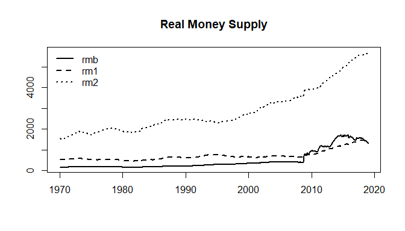
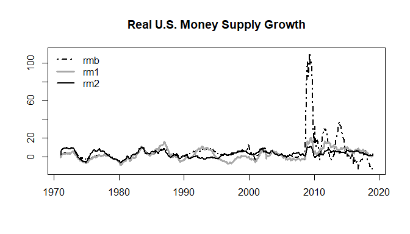
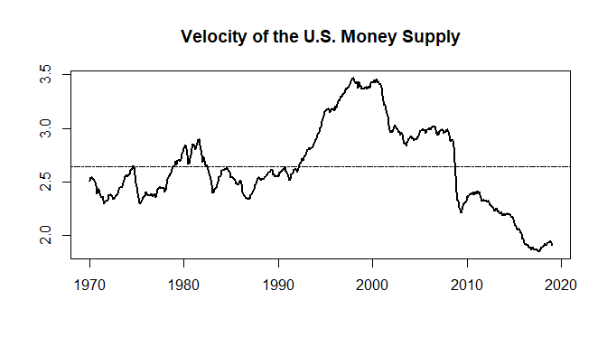

Money: Example
================
Scott W. Hegerty
ECON 343, Spring 2023

Here, we apply some previous to analyze monetary aggregates: The
Monetary Base, M1, and M2. We convert nominal to real values and
calculate growth rates, before calculating some summary statistics and
correlations, and plotting the variables.

One additional exercise is to analyze the equation of exchange,
*M*<sub>*s*</sub>*V* = *PY*, which connects the money supply to the
price level (*P*) and real output (*Y*). The fourth variable *V* is
velocity, or the number of times each unit of currency is spent. Money
is spent in sufficient quantities to cover nominal output. Here, we
simply solve for *V* = *P**Y*/*M*<sub>*s*</sub>. Classical theory
assumes Velocity to be stable; we can see whether this is indeed the
case. We can also calculate the correlation between money supply growth
and inflation.

### Procedure

First, we download the data from the course website:

``` r
data<-read.csv("https://raw.githubusercontent.com/hegerty/ECON343/main/MoneyData343.csv",header=TRUE)
head(data)
```

    ##   observation_date  CPI      IP     MB    M1    M2
    ## 1         1/1/1970 37.9 39.0743 62.218 206.2 589.6
    ## 2         2/1/1970 38.1 39.0485 62.405 205.0 586.3
    ## 3         3/1/1970 38.3 38.9978 62.530 205.7 587.3
    ## 4         4/1/1970 38.5 38.8975 63.059 206.7 588.4
    ## 5         5/1/1970 38.6 38.8522 63.458 207.2 591.5
    ## 6         6/1/1970 38.8 38.7265 63.724 207.6 595.2

Here, *IP* is an index of Industrial Production; with monthly data this
is a good proxy for real GDP.

Next, we convert the data to time series:

``` r
data<-ts(data[,-1],start=c(1970,1),frequency = 12)
head(data)
```

    ##       CPI      IP     MB    M1    M2
    ## [1,] 37.9 39.0743 62.218 206.2 589.6
    ## [2,] 38.1 39.0485 62.405 205.0 586.3
    ## [3,] 38.3 38.9978 62.530 205.7 587.3
    ## [4,] 38.5 38.8975 63.059 206.7 588.4
    ## [5,] 38.6 38.8522 63.458 207.2 591.5
    ## [6,] 38.8 38.7265 63.724 207.6 595.2

Now, we generate the real money supply variables, multiplying by 100. In
the base year, nominal and real variables will be equal.

``` r
rmb<-100*data[,3]/data[,1]
rm1<-100*data[,4]/data[,1]
rm2<-100*data[,5]/data[,1]
```

Here, we make a set of real variables and plot them:

``` r
realvars<-cbind(rmb, rm1,rm2)
ts.plot(realvars,lty=c(1,2,3),lwd=c(2,2,2),xlab="",main="Real Money Supply")
legend("topleft",legend=colnames(realvars),lty=c(1,2,3),lwd=c(2,2,2),bty="n")
```

<!-- -->

Next, we make a single set of all our variables:

``` r
allvars<-cbind(data,realvars)
head(allvars)
```

    ##      data.CPI data.IP data.MB data.M1 data.M2 realvars.rmb realvars.rm1
    ## [1,]     37.9 39.0743  62.218   206.2   589.6     164.1636     544.0633
    ## [2,]     38.1 39.0485  62.405   205.0   586.3     163.7927     538.0577
    ## [3,]     38.3 38.9978  62.530   205.7   587.3     163.2637     537.0757
    ## [4,]     38.5 38.8975  63.059   206.7   588.4     163.7896     536.8831
    ## [5,]     38.6 38.8522  63.458   207.2   591.5     164.3990     536.7876
    ## [6,]     38.8 38.7265  63.724   207.6   595.2     164.2371     535.0515
    ##      realvars.rm2
    ## [1,]     1555.673
    ## [2,]     1538.845
    ## [3,]     1533.420
    ## [4,]     1528.312
    ## [5,]     1532.383
    ## [6,]     1534.021

We can calculate growth rates (with a 12-month lag) for all variables at
once:

``` r
growthrates<-100*(allvars/lag(allvars,-12)-1)
```

Make sure you check the beginning and end of your new series; sometimes
people put the wrong lags in, and it doesn’t line up correctly. Also,
the generated names are unwieldy, so I rename the column names. I
re-name a few but keep the originals for the rest–so “M2” is really “M2
growth.”

``` r
head(growthrates)
```

    ##      allvars.data.CPI allvars.data.IP allvars.data.MB allvars.data.M1
    ## [1,]         5.277045      -1.1040505        7.126555        4.510184
    ## [2,]         4.724409      -1.2274479        7.778223        6.048780
    ## [3,]         4.438642      -1.2062219        8.199264        6.368498
    ## [4,]         4.155844      -0.3951411        7.737198        6.434446
    ## [5,]         4.404145       0.2270142        8.062025        7.142857
    ## [6,]         4.381443       0.9740100        8.235516        7.658960
    ##      allvars.data.M2 allvars.realvars.rmb allvars.realvars.rm1
    ## [1,]        7.343962             1.756803           -0.7284214
    ## [2,]        9.329695             2.916047            1.2646250
    ## [3,]       10.658948             3.600796            1.8478367
    ## [4,]       11.896669             3.438457            2.1876851
    ## [5,]       12.713440             3.503578            2.6231833
    ## [6,]       13.071237             3.692296            3.1399415
    ##      allvars.realvars.rm2
    ## [1,]             1.963312
    ## [2,]             4.397528
    ## [3,]             5.955942
    ## [4,]             7.431964
    ## [5,]             7.958779
    ## [6,]             8.325037

``` r
colnames(growthrates)<-c("INF", "GROWTH",colnames(data)[-c(1,2)],colnames(realvars))
tail(growthrates)
```

    ##             INF   GROWTH         MB       M1       M2       rmb         rm1
    ## [572,] 2.683278 5.453333  -8.283164 2.764823 3.791691 -10.67987  0.07941381
    ## [573,] 2.269315 5.664108  -8.077919 3.614795 3.695901 -10.11763  1.31562452
    ## [574,] 2.517164 4.356620  -8.047059 3.105332 3.418772 -10.30483  0.57372580
    ## [575,] 2.194621 4.453517 -11.028909 1.779320 3.378736 -12.93956 -0.40638222
    ## [576,] 1.945131 4.077534 -11.789525 3.654485 3.868061 -13.47260  1.67673895
    ## [577,] 1.522396 3.800939 -12.607197 2.296617 4.312179 -13.91771  0.76261073
    ##              rm2
    ## [572,] 1.0794486
    ## [573,] 1.3949309
    ## [574,] 0.8794704
    ## [575,] 1.1586858
    ## [576,] 1.8862402
    ## [577,] 2.7479480

We can plot the growth rates. these are columns 6, 7, and 8:

``` r
x<-growthrates[,6:8]
plot(x,plot.type="single",ylab="",xlab="",col=c("black","dark grey","black"),lwd=c(2,3,2),lty=c(4,1,1),main="Real U.S. Money Supply Growth")
legend("topleft",legend=colnames(x),col=c("black","dark grey","black"),lwd=c(2,3,2),lty=c(4,1,1),bty="n")
```

<!-- -->

Is money supply growth correlated with inflation? We can easily
calculate the correlations between all variable pairs:

``` r
round(cor(growthrates),3)
```

    ##           INF GROWTH     MB     M1     M2    rmb    rm1    rm2
    ## INF     1.000 -0.071 -0.189 -0.088  0.221 -0.370 -0.572 -0.617
    ## GROWTH -0.071  1.000 -0.394 -0.164 -0.022 -0.364 -0.113  0.024
    ## MB     -0.189 -0.394  1.000  0.428  0.112  0.982  0.458  0.255
    ## M1     -0.088 -0.164  0.428  1.000  0.272  0.418  0.867  0.297
    ## M2      0.221 -0.022  0.112  0.272  1.000  0.063  0.111  0.630
    ## rmb    -0.370 -0.364  0.982  0.418  0.063  1.000  0.540  0.359
    ## rm1    -0.572 -0.113  0.458  0.867  0.111  0.540  1.000  0.551
    ## rm2    -0.617  0.024  0.255  0.297  0.630  0.359  0.551  1.000

Nominal M2 Growth has a small, positive coefficient, while the
coefficient is negative for real M2 growth (which is calculated using
the inflation rate!). More sophisticated methods woild have to be used
in any case.

Finally, we can calculate Velocity using the *levels* variables (not
growth rates). We choose M2 for the money supply variable. We can
calculate the mean value of velocity, and plot the variable’s movement
over time.

Let’s review which variables we need:

``` r
colnames(data)
```

    ## [1] "CPI" "IP"  "MB"  "M1"  "M2"

``` r
v<-allvars[,1]*data[,2]/data[,5]
print(mean(v))
```

    ## [1] 2.639819

``` r
plot(v,lwd=2,ylab="",xlab="",main="Velocity of the U.S. Money Supply")
abline(h=mean(v),lty=6)
```

<!-- -->

Velocity is not perfectly stable over this time period.
