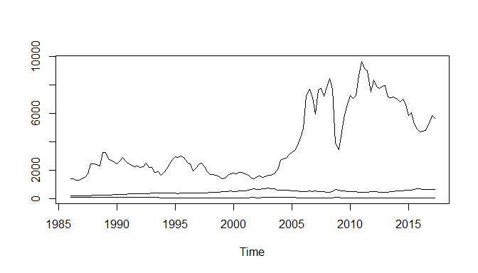
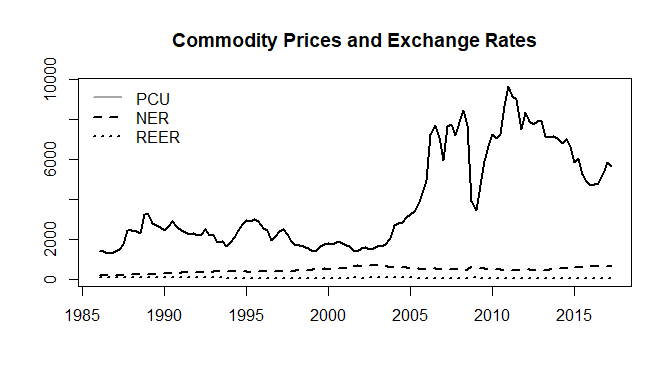
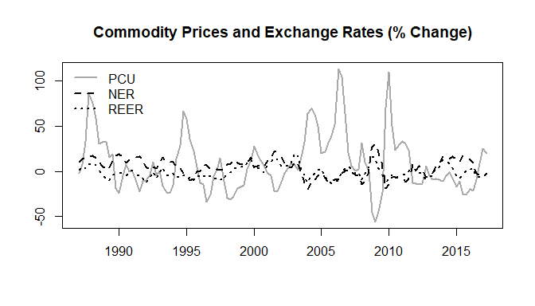

Prices: Example
================
Scott W. Hegerty
ECON 343, Spring 2023

In this example, we calculate percentage changes in variables, as well
as some correlations between variables.

Here, the main goal is to calculate the percentage changes in copper
prices, although we can also examine correlations with the Chilean peso.
We might expect that the peso is a “commodity currency” due to its
importance in Chilean exports.

### Procedure

First, we pull the dataset: It has quarterly data for the following:
Global Price of Copper, quarterly (Source: IMF, via FRED); Nominal
Exchange Rate and Real Effective Exchange rate for Chile (Source:
Central Bank of Chile):

``` r
data<-read.csv("https://raw.githubusercontent.com/hegerty/ECON343/main/PriceData343.csv",header=T)
head(data)
```

    ##   observation_date      PCU    NER   REER
    ## 1       1986-01-01 1421.980 186.85 100.00
    ## 2       1986-04-01 1421.245 188.67  98.45
    ## 3       1986-07-01 1319.098 194.12 101.15
    ## 4       1986-10-01 1316.893 201.69 100.50
    ## 5       1987-01-01 1396.259 206.15 101.72
    ## 6       1987-04-01 1524.862 214.10 103.40

``` r
tail(data)
```

    ##     observation_date      PCU    NER  REER
    ## 121       2016-01-01 4674.735 702.07 77.97
    ## 122       2016-04-01 4736.414 677.69 76.82
    ## 123       2016-07-01 4779.593 661.65 74.95
    ## 124       2016-10-01 5280.848 665.80 73.83
    ## 125       2017-01-01 5840.034 655.58 72.79
    ## 126       2017-04-01 5667.741 664.68 74.89

The data run from to 1986Q1 to 2017Q2.

We next make a quarterly time series:

``` r
datats<-ts(data[,-1],start=c(1986,1),frequency = 4)
```

We can plot the time series. A simple ts(plot) will work fine for
starters:

``` r
ts.plot(datats)
```

<!-- -->

This one is more customized, however.

<!-- -->

Now, we can take 4-quarter inflation rates for each variable:

``` r
perch<-100*((datats/lag(datats,-4)-1))
head(perch)
```

    ##      datats.PCU datats.NER datats.REER
    ## [1,]  -1.808784   10.32914    1.720000
    ## [2,]   7.290577   13.47856    5.027933
    ## [3,]  32.869081   15.69648    2.787939
    ## [4,]  86.104910   15.40979    7.223881
    ## [5,]  75.421073   17.56488    8.955958
    ## [6,]  58.843403   14.48389    6.798839

We can replace the column names with the originals:

``` r
colnames(perch)<-colnames(datats)
```

Here is a plot of the new series:

<!-- -->

Copper prices appear to be much more volatile than either exchange rate.
We can compare the standard deviations of each series:

``` r
apply(datats,FUN = "sd",2)
```

    ##        PCU        NER       REER 
    ## 2413.95365  138.67515   10.93654

This is clearly the case.

Now, we can plot the correlations between each variable pair.

``` r
cor1<-round(cor(perch),3)
print(cor1)
```

    ##         PCU    NER   REER
    ## PCU   1.000 -0.599 -0.262
    ## NER  -0.599  1.000  0.634
    ## REER -0.262  0.634  1.000

I round the numbers and remove the redundant lower triangle, so that
this matches how correlation tables are typically presented.

``` r
cor1[lower.tri(cor1)]<-""
print(noquote(cor1))
```

    ##      PCU NER    REER  
    ## PCU  1   -0.599 -0.262
    ## NER      1      0.634 
    ## REER            1

The exchange rates are positively correlated, and copper prices are
negatively correlated with the peso. This makes sense: *NER* is the
value of pesos per dollar, and rises as the peso becomes weaker. Falling
copper prices are associated with a rising dollar and a weaker peso.
