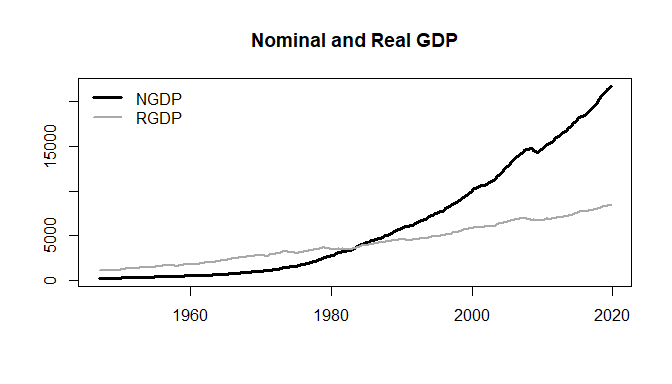
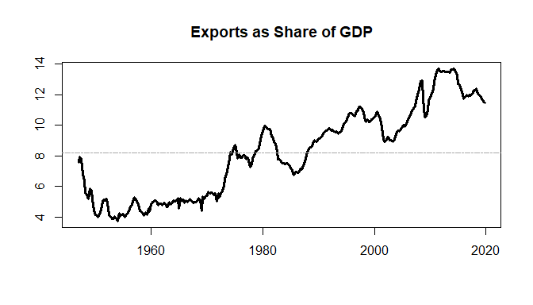

Real Variables in R
================
Scott W. Hegerty
ECON 343, Spring 2023

This is a simple calculation of U.S. real GDP, as well as the ratio of
exports to GDP. We can calculate summary statistics and/or plot the new
series.

### Procedure

We begin by pulling the sample data from the course website. I often
collect data from FRED and other sources in advance, although one major
goal of the course is to learn to to find and organize your own data.

``` r
data<-read.csv("https://raw.githubusercontent.com/hegerty/ECON343/main/MacroDataExample.csv",header=TRUE)
```

Always make sure you check your data to make sure it looks the way you
expect it to:

``` r
head(data)
```

    ##     ï..DATE      X      M     GDP      CPI     DATE P_EDUC CPI.1
    ## 1  1/1/1947 18.394  7.519 243.164 21.70000 1/1/1993   76.1 142.8
    ## 2  4/1/1947 19.497  8.203 245.968 22.01000 2/1/1993   76.5 143.1
    ## 3  7/1/1947 19.433  7.663 249.585 22.49000 3/1/1993   77.0 143.3
    ## 4 10/1/1947 17.636  8.347 259.745 23.12667 4/1/1993   77.4 143.8
    ## 5  1/1/1948 16.917  9.624 265.742 23.61667 5/1/1993   77.8 144.2
    ## 6  4/1/1948 15.241 10.036 272.567 23.99333 6/1/1993   78.3 144.3

``` r
tail(data)
```

    ##     ï..DATE  X  M GDP CPI      DATE  P_EDUC   CPI.1
    ## 322         NA NA  NA  NA 10/1/2019 267.042 257.229
    ## 323         NA NA  NA  NA 11/1/2019 267.482 257.824
    ## 324         NA NA  NA  NA 12/1/2019 267.873 258.444
    ## 325         NA NA  NA  NA  1/1/2020 268.685 258.820
    ## 326         NA NA  NA  NA  2/1/2020 269.513 259.050
    ## 327         NA NA  NA  NA  3/1/2020 270.221 257.953

This dataset is used elsewhere for two different examples, so it has
some other variables. We only need the first few columns. Since they
were included with longer series, we need to make sure we remove any
“NA”s as well.

``` r
data<-na.omit(data[,2:5])
tail(data)
```

    ##            X        M      GDP      CPI
    ## 287 2510.294 3181.647 20749.75 251.8827
    ## 288 2510.517 3194.665 20897.80 252.6973
    ## 289 2520.278 3154.126 21098.83 253.2753
    ## 290 2504.031 3166.691 21340.27 255.1707
    ## 291 2495.136 3148.168 21542.54 256.3247
    ## 292 2497.726 3075.592 21729.12 257.8323

Now we calculate real GDP using the Consumer Price Index as a deflator:

``` r
attach(data)
RGDP<-100*GDP/CPI
```

We can also calculate the ratio of exports to GDP. Make sure you divide
(nominal) exports by nominal GDP. Multiplying by 100 gives a percentage.

``` r
Xshare<-100*X/GDP
```

We can collect our new variables in a new dataframe. We also need to
rename the first column:

``` r
data2<-cbind(data$GDP,RGDP,Xshare)
colnames(data2)[1]<-"NGDP"
head(data2)
```

    ##         NGDP     RGDP   Xshare
    ## [1,] 243.164 1120.571 7.564442
    ## [2,] 245.968 1117.528 7.926641
    ## [3,] 249.585 1109.760 7.786125
    ## [4,] 259.745 1123.141 6.789736
    ## [5,] 265.742 1125.231 6.365949
    ## [6,] 272.567 1136.011 5.591653

Next, we can set this as a quarterly time series, which begins in 1947
quarter 1.

``` r
tsdata<-ts(data2,start = c(1947,1),freq=4)
```

Now, we can plot nominal and real GDP together in one graph. It is
important to note which part of the code is *customization*; the code
would work without it. This plots columns 1 and 2 (which is necessary to
specify), but much of the rest is line color, line width, etc. I also
made a legend for the graph.

``` r
ts.plot(tsdata[,c(1,2)],col=c("black","dark grey"),lwd=c(3,2),xlab="",main="Nominal and Real GDP")
legend("topleft",legend=c(colnames(data2)[c(1,2)]),col=c("black","dark grey"),lwd=c(3,2),bty="n")
```

<!-- -->

We see that the lines cross in the “base year,” which is often an
average over the period from 1982 to 1984. As prices rise, nominal GDP
exceeds real GDP.

Finally, we can plot the export share, which is column 3. An extra line
shows the average value over the period; exports have grown in recent
years.

``` r
plot(tsdata[,3],lwd=3,xlab="",ylab="",main="Exports as Share of GDP")
abline(h=mean(tsdata[,3]),lty=6,col="dark grey")
```

<!-- -->

We can also show some summary statistics for the export share:

``` r
summary(Xshare)
```

    ##    Min. 1st Qu.  Median    Mean 3rd Qu.    Max. 
    ##   3.743   5.170   8.281   8.195  10.433  13.717

The mean value is the horizontal line above.

I also like to include the standard deviation:

``` r
sd(Xshare)
```

    ## [1] 2.884743

We could even make a table with our five summary statistics:

<table style="width:20%;">
<thead>
<tr>
<th style="text-align:left;">
</th>
<th style="text-align:right;">
Statistic
</th>
</tr>
</thead>
<tbody>
<tr>
<td style="text-align:left;">
Mean
</td>
<td style="text-align:right;">
8.20
</td>
</tr>
<tr>
<td style="text-align:left;">
SD
</td>
<td style="text-align:right;">
2.88
</td>
</tr>
<tr>
<td style="text-align:left;">
Median
</td>
<td style="text-align:right;">
8.28
</td>
</tr>
<tr>
<td style="text-align:left;">
Min
</td>
<td style="text-align:right;">
3.74
</td>
</tr>
<tr>
<td style="text-align:left;">
Max
</td>
<td style="text-align:right;">
13.72
</td>
</tr>
</tbody>
</table>
