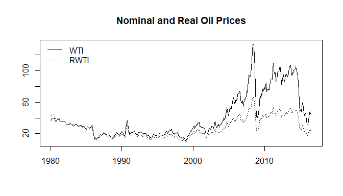
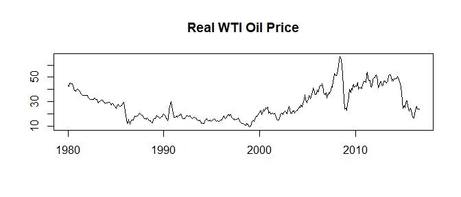
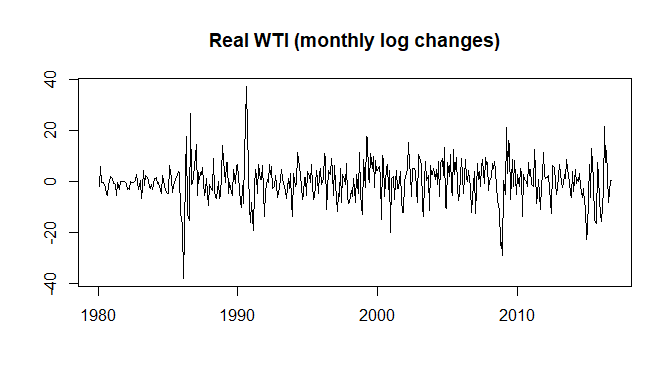
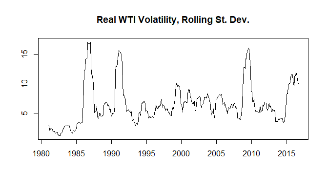
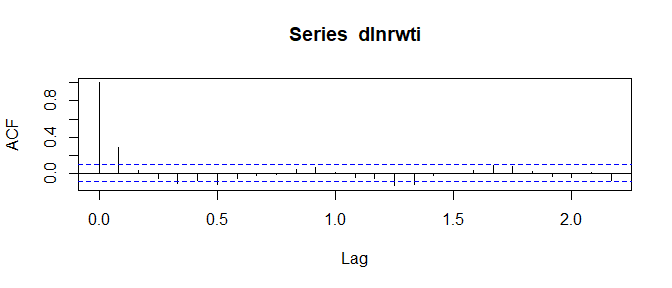
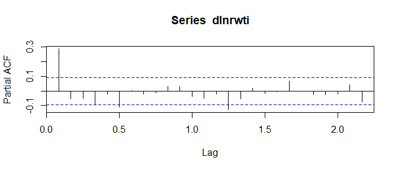
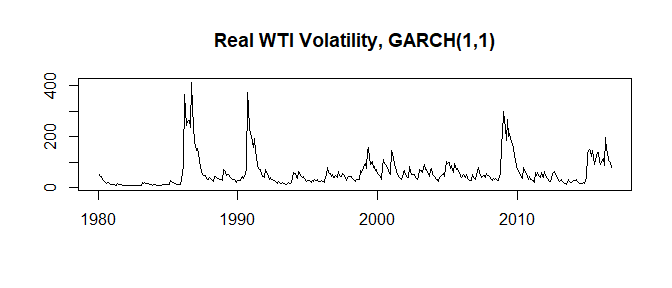

WTI Example
================
Scott W. Hegerty
ECON 343, Spring 2023

This example runs the oil-price volatility modeling exercise from
\*Macroeconomic Data Analysis.” The course originally used Eviews and
Excel; here it is in R. A few of the numbers might not be exactly the
same due to differences in how I set up the calculations.

### Procedure

First, pull the preformatted data from the website. Remember that an
essential part of the course is finding the data yourself and
constructing a usable database, but this is a defined example.

``` r
data<-read.csv("https://raw.githubusercontent.com/hegerty/ECON343/main/WTI_Data.csv",header=TRUE)
head(data)
```

    ##       DATE   WTI  PPI
    ## 1 1/1/1980 37.00 85.2
    ## 2 2/1/1980 37.04 86.9
    ## 3 3/1/1980 39.52 87.5
    ## 4 4/1/1980 39.50 87.8
    ## 5 5/1/1980 39.50 88.3
    ## 6 6/1/1980 39.50 88.7

The data (West Texas Intermediate oil price, in dollars, and the U.S.
Producer Price Index) are monthly and begin in January, 1980.

Next, we isolate the main variables and use them to create the real oil
price. We save a step and immediately format the real oil price *WTI* as
a time series.

``` r
wti<-data[,2]
ppi<-data[,3]
rwti<-ts(100*wti/ppi,start=c(1980,1),frequency = 12)
```

Next, we calculate log changes and percent changes, both month-on-month
and year-over-year. This gives us three versions of the percent change
in real oil prices. Note the functions used, including logs, lags, and
differences:

``` r
dlnrwti<-100*diff(log(rwti))
momrwti<-100*diff(rwti)/lag(rwti,-1)
yoyrwti<-100*diff(rwti,12)/lag(rwti,-12)
```

#### Measuring Volatility

The main goal here is to measure the time-varying volatility of log real
oil prices, first by calculating a rolling standard deviation. Here, I
make sure that these results match Excel’s population standard deviation
by adjusting by the population parameter
(*n*/*n*<sub>1</sub>)<sup>.5</sup>. In this exercise, we will need to
make sure we have the *zoo* and the *rugarch* packages installed. We
apply the standard deviation function over rolling 12-month windows.
Then we make a time series and adjust the population size.

``` r
library(zoo)
sd12dln<-rollapply(dlnrwti,12,FUN="sd")
sd12dln<-ts(sd12dln,end=c(2016,9),frequency = 12)
sd12dln<-sqrt(11/12)*sd12dln
```

We can make a matrix that includes all of our series: Nominal WTI, the
PPI, real WTI, the three inflation rates, and the volatility term. We
lose 11 observations, since the first 12 months generate only one
rolling standard deviation.

``` r
series<-na.omit(cbind(wti,ppi,rwti,dlnrwti,momrwti,yoyrwti,sd12dln))
print(head(series))
```

    ##        wti  ppi     rwti    dlnrwti    momrwti    yoyrwti  sd12dln
    ## [1,] 38.00 95.2 39.91597  1.2123468  1.2197255  -8.085396 2.895510
    ## [2,] 38.00 96.1 39.54214 -0.9409374 -0.9365245  -7.229690 2.875698
    ## [3,] 38.00 97.0 39.17526 -0.9321663 -0.9278351 -13.263283 2.128549
    ## [4,] 37.99 98.0 38.76531 -1.0519693 -1.0464554 -13.833066 2.115847
    ## [5,] 36.02 98.3 36.64293 -5.6305176 -5.4749376 -18.086818 2.422183
    ## [6,] 36.00 98.5 36.54822 -0.2587922 -0.2584577 -17.928420 2.430802

We can plot this matrix as a time series (another option could be to
re-format it, but I will leave it as-is here). First, we plot the
nominal and real oil price:

``` r
ts.plot(cbind(wti,rwti),lty=c(1,3),col=c("black","#333333"),xlab="",ylab="",main = "Nominal and Real Oil Prices")
legend("topleft",legend=c("WTI","RWTI"),lty=c(1,3),col=c("black","#333333"),bty="n")
```

<!-- -->

We can also plot the real oil price by itself:

``` r
ts.plot(rwti,xlab="",ylab="",main = "Real WTI Oil Price")
```

<!-- -->

Next, we plot log changes (the percentage change):

``` r
ts.plot(dlnrwti,xlab="",ylab="",main = "Real WTI (monthly log changes)")
```

<!-- -->

We also plot the rolling standard deviation. Note periods of high
volatility in the late 1980s, during the 1991 Gulf War, and around the
2008 Global Financial Crisis.

``` r
ts.plot(sd12dln,xlab="",ylab="",main = "Real WTI Volatility, Rolling St. Dev.")
```

<!-- -->

Next, we make a (formatted) correlation table for the percentage change
series. The (monthly) log approximation is very close to the monthly
inflation rate, but the annual inflation rate differs from the other two
series.

``` r
cortable<-round(cor(series[,4:6]),3)
cortable[lower.tri(cortable)]<-""
print(noquote(cortable))
```

    ##         dlnrwti momrwti yoyrwti
    ## dlnrwti 1       0.996   0.268  
    ## momrwti         1       0.256  
    ## yoyrwti                 1

We then make a table of summary statistics. This uses the *apply()*
function and also compiles and rounds the numbers. The ‘2’ in the
*apply()* function refers to columns (rows would be ‘1’). For this
example, the statistics are calculated for the common sample that begins
in 1981, so mean *RWTI* would be different if the full sample (beginning
in 1980) were used.

``` r
series2<-series[,c(1,3,4,7)]
sumtable<-rbind(colMeans(series2),apply(series2,2,sd),apply(series2,2,min),apply(series2,2,max))
rownames(sumtable)<-c("Mean","SD","Min","Max")
print(round(sumtable,2))
```

    ##         wti  rwti dlnrwti sd12dln
    ## Mean  41.23 27.23   -0.11    6.52
    ## SD    28.36 12.33    7.75    3.31
    ## Min   11.31  9.21  -38.04    1.25
    ## Max  133.93 66.80   37.36   17.07

Many academic papers require this table, even if you never refer to it
again.

### The GARCH Model

The R results do not exactly match the EViews results used elsewhere,
but the *rugarch* package is comes close.

``` r
library(rugarch)
```

We use the traditional Box-Jenkins approach to identify an appropriate
ARMA(*p*,*q*) model via the Autocorrelation Function and the Partial
Autocorrelation Function:

``` r
acf(dlnrwti)
```

<!-- -->

``` r
pacf(dlnrwti)
```

<!-- -->

For our purposes, an AR(1) will work. We don’t seem to need any higher
AR order, and this looks better than an ARMA(1,1):

``` r
ar1<-arima(dlnrwti,order = c(1,0,0))
print(ar1)
```

    ## 
    ## Call:
    ## arima(x = dlnrwti, order = c(1, 0, 0))
    ## 
    ## Coefficients:
    ##          ar1  intercept
    ##       0.2873    -0.1344
    ## s.e.  0.0456     0.4901
    ## 
    ## sigma^2 estimated as 53.78:  log likelihood = -1501.06,  aic = 3008.12

``` r
arma11<-arima(dlnrwti,order = c(1,0,1))
print(arma11)
```

    ## 
    ## Call:
    ## arima(x = dlnrwti, order = c(1, 0, 1))
    ## 
    ## Coefficients:
    ##          ar1     ma1  intercept
    ##       0.1504  0.1503    -0.1376
    ## s.e.  0.1525  0.1518     0.4725
    ## 
    ## sigma^2 estimated as 53.66:  log likelihood = -1500.55,  aic = 3009.11

No coefficient is significant in the ARMA(1,1) model.

We specify a GARCH(1,1) model with an AR(1) mean equation as follows:

``` r
g1<-ugarchspec(variance.model=list(model="sGARCH",garchOrder=c(1,1)),mean.model=list(armaOrder=c(1,0)),distribution.model="std")
```

Next, we fit the model:

``` r
garch11<-ugarchfit(g1,data = dlnrwti)
```

We can examine the coefficients from the model–they should all be
significant.

``` r
garch11@fit$matcoef
```

    ##          Estimate  Std. Error   t value     Pr(>|t|)
    ## mu     -0.3274099  0.31233531 -1.048264 2.945169e-01
    ## ar1     0.2189884  0.04979272  4.398000 1.092528e-05
    ## omega   1.5907510  1.24291738  1.279853 2.005970e-01
    ## alpha1  0.2537457  0.05531249  4.587493 4.486004e-06
    ## beta1   0.7452543  0.05582120 13.350741 0.000000e+00
    ## shape   8.8783725  3.23272514  2.746405 6.025233e-03

The intercepts are not significant, but the others are.

Finally, we generate the resulting GARCH series and plot it:

``` r
vol1 <- ts(garch11@fit$sigma^2,end=c(2016,9),frequency = 12)
ts.plot(vol1,xlab="",yab="",main="Real WTI Volatility, GARCH(1,1)")
```

<!-- -->

The same periods exhibit volatility as was shown with the moving
standard deviation.
